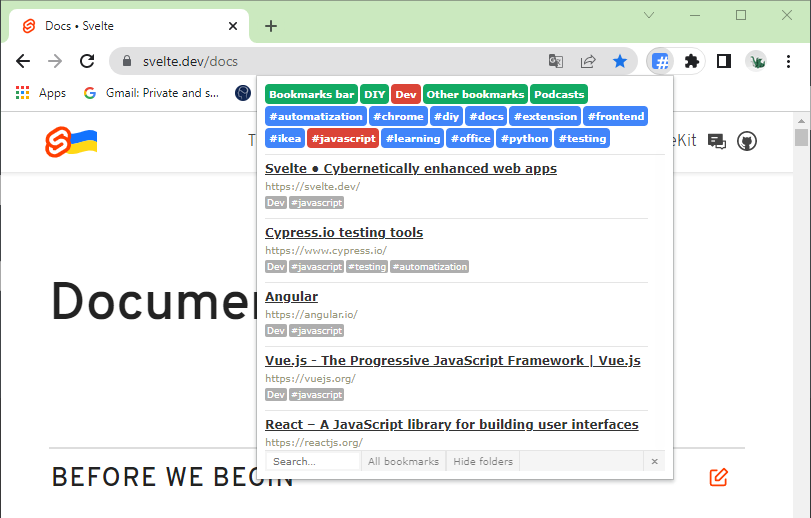
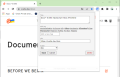
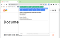

Chromtag
========

With Chromtag, you can quickly find the bookmark you need. 

You can just add a #hashtag to your bookmark title or edit it directly in the extension.

You don't have to worry about your data loss or privacy because Chromtag uses the browser's native bookmarks.

----

[**Install from Chrome Web Store**](https://chrome.google.com/webstore/detail/chromtag-tag-your-bookmar/epeiimpoigheahfbmmhadnfgimaacipk)

----

## Features

| Add #hashtag | Tags and folders filtering | Search  |
|---|---|---|
|    |   |   |

## Why Chromtag?

* In Chrome, you can organize your bookmarks only with folders. With Chromtag you can also add tags and quick search your bookmarks.
* Unlike the others, Chromtag uses the browser's native bookmarks. So you don't have to worry about your data loss or privacy.

## Used libraries

* jQuery: http://jquery.com/
* NanoScroller: http://jamesflorentino.github.io/nanoScrollerJS/
* Yahoo! (YUI 3) Reset CSS: http://www.cssreset.com/scripts/yahoo-css-reset-yui-3/

## Version history

* 1.8 (2024-01-25)
  * Increased font and window sizes
  * Added a button for creating a new bookmark
* 1.7 (2022-06-22)
  * Tag list added to editor
* 1.6 (2022-06-09)
  * Fix: move bookmark to folder
* 1.5 (2022-06-07)
  * Updated manifest to v3 (favicons removed due to this change)
* 1.4 (2014-05-29)
  * Better support for non-latin characters
* 1.3 (2014-05-28)
  * New rendering
  * Favicons
* 1.2 (2014-01-10)
  * Sorting folders and tags by name
  * Searching
  * Bookmark editor
* 1.1 (2013-11-23)
  * Publicated on Chrome Store!
* 1.0 (2013-11-20)
  * First released version.